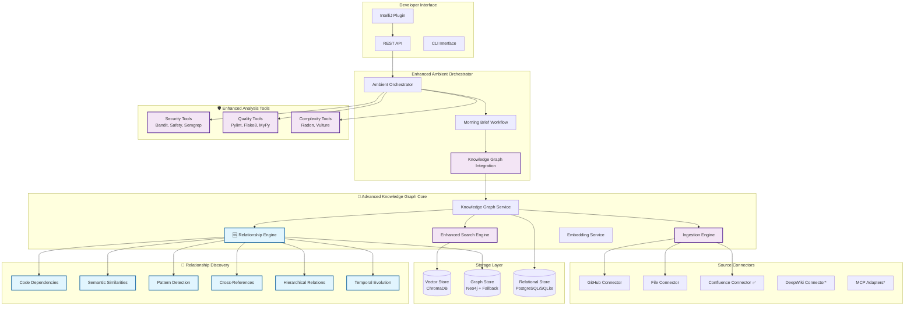

# DevEx Ambient Agent with Advanced Knowledge Graph

<div align="center">

**🚀 Elevating Developer Experience through Intelligent AI and Knowledge-Driven Code Evaluation**


[](https://langchain.com)

[](#)


An intelligent ambient agent that proactively analyzes code and provides morning briefings with actionable insights, enhanced with a sophisticated **Advanced Knowledge Graph system** featuring state-of-the-art relationship discovery and pattern detection algorithms.

[🚀 Quick Start](#-quick-start) •
[📖 Documentation](#-documentation) •
[🎯 Features](#-features) •
[🏗️ Architecture](#%EF%B8%8F-architecture) •
[🤝 Contributing](#-contributing)

</div>

---

## 📋 Table of Contents

- [✨ Features](#-features)
- [🏗️ Architecture](#%EF%B8%8F-architecture)
- [🔧 Technology Stack](#-technology-stack)
- [🚀 Quick Start](#-quick-start)
- [⚙️ Installation](#%EF%B8%8F-installation)
- [📚 Knowledge Graph Setup](#-knowledge-graph-setup)
- [🌐 Confluence Authentication & Setup](#-confluence-authentication--setup)
- [🧪 Enhanced Analysis Setup](#-enhanced-analysis-setup)
- [🚀 Production Deployment](#-production-deployment)
- [🎯 Usage Examples](#-usage-examples)
- [📖 API Reference](#-api-reference)
- [🧪 Testing](#-testing)
- [🚀 Deployment](#-deployment)
- [🔧 Configuration](#-configuration)

---

## ✨ Features

### 🌟 Core Ambient Agent

- **🌅 Enhanced Morning Brief Generation**: Intelligent daily summaries using LangGraph workflows **with Knowledge Graph insights**
- **🔬 Professional Code Analysis**: Real-world security and quality analysis with industry-standard tools
- **📊 AI-Powered Pattern Detection**: Advanced LLM-based pattern recognition and anomaly detection
- **🔄 Event-Driven Architecture**: Seamless integration with IDEs and development tools
- **⚡ Real-time Processing**: Ambient event processing with intelligent prioritization

### 🧠 Knowledge Graph System

#### **🚀 Relationship Discovery Engine**
- **🕸️ Multi-Algorithm Relationship Detection**: 
  - **Code Dependencies**: AST-based import analysis, function call mapping
  - **Semantic Similarities**: Vector embedding-based content matching  
  - **Design Pattern Detection**: Singleton, Factory, Observer, Strategy, Decorator patterns
  - **Cross-References**: Documentation-to-code and issue-to-code linking
  - **Hierarchical Relationships**: Class inheritance and composition analysis
  - **Temporal Evolution**: Version superseding and evolution tracking

#### **📊 Graph Analysis Algorithms**
- **Centrality Metrics**: Identify the most important/connected entities
- **Community Detection**: Find clusters of related functionality
- **Influence Analysis**: Understanding which patterns influence others
- **Path Analysis**: Shortest paths and relationship strength calculations

#### **🎯 Code Evaluation & Context**
- **📚 Golden Source Management**: Register GitHub repos, Confluence pages, DeepWiki content, and text files
- **🔍 Advanced Semantic Search**: Multi-collection vector search with relationship enrichment
- **🎯 Pattern-Aware Code Evaluation**: Compare new code against established patterns with confidence scoring
- **🔗 Intelligent Relationship Mapping**: Understand dependencies, similarities, and conflicts between code patterns
- **⚡ Context-Aware Recommendations**: Receive relevant knowledge precisely when and where you need it
- **🤖 Golden Source Alignment**: Track how well your code aligns with organizational standards

#### **🚀 Morning Brief Integration**
- **📊 Golden Source Alignment Scores**: How well recent changes follow established patterns
- **🔍 Pattern-Based Insights**: Recommendations based on similar code patterns from golden sources
- **📚 Contextual Documentation**: Relevant docs and examples for current development context
- **🎯 Relationship-Aware Suggestions**: Guidance based on code relationships and dependencies

### 🛡️ Advanced Code Analysis

- **🔐 Security Analysis**: Bandit, Safety, Semgrep for comprehensive security scanning
- **📏 Quality Metrics**: Pylint, Flake8, MyPy for code quality and style analysis
- **📈 Complexity Analysis**: Radon for cyclomatic complexity measurement
- **🧹 Dead Code Detection**: Vulture for unused code identification
- **📄 Enhanced Reporting**: File-level details with line numbers, severity levels, and actionable insights

---

## 🏗️ Architecture



### 🔗 Relationship Types Discovered

The Advanced Relationship Engine discovers and analyzes **8 distinct relationship types**:

| Relationship Type | Description | Use Cases |
|------------------|-------------|-----------|
| **DEPENDS_ON** | Code imports, function calls, dependencies | Impact analysis, refactoring guidance |
| **SIMILAR_TO** | Semantically related content | Code reuse, pattern discovery |
| **IMPLEMENTS** | Design pattern implementations | Architecture consistency |
| **RELATED_TO** | Cross-references (docs ↔ code, issues ↔ code) | Knowledge linking, documentation gaps |
| **INHERITS_FROM** | Class inheritance, interface implementation | Hierarchy analysis, OOP insights |
| **SUPERSEDES** | Temporal evolution, version relationships | Change tracking, deprecation |
| **INSPIRED_BY** | Influence and derivation patterns | Learning paths, best practice adoption |
| **CONTRADICTS** | Conflicting implementations *(planned)* | Consistency checking, conflict resolution |

---

## 🔧 Technology Stack

### Core Technologies
- **Python 3.9+** - Primary development language
- **uv** - Modern, fast dependency management (migrated from Poetry)
- **FastAPI** - High-performance async web framework
- **LangChain & LangGraph** - Advanced AI workflow orchestration
- **Pydantic** - Data validation and serialization

### Knowledge Graph & AI
- **ChromaDB** - Vector database for semantic search and embeddings
- **Neo4j** - Graph database for relationship storage (with in-memory fallback)
- **SentenceTransformers** - Text embedding generation (`all-MiniLM-L6-v2`)
- **OpenAI API** - LLM integration for intelligent analysis
- **Advanced Graph Algorithms** - Custom relationship discovery and analysis

### Code Analysis Tools
- **Security**: Bandit, Safety, Semgrep
- **Quality**: Pylint, Flake8, MyPy
- **Complexity**: Radon (cyclomatic complexity)
- **Dead Code**: Vulture
- **AST Analysis** - Python Abstract Syntax Tree parsing for dependency detection

### Source Integration
- **GitHub API** - Repository content and metadata ingestion
- **File System** - Local file and directory scanning
- **HTTP/REST** - Generic connector framework
- **Current**: GitHub, Local Files, Confluence team documentation
- **Future**: DeepWiki, MCP protocol adapters

---

## 🚀 Quick Start

### Prerequisites
- Python 3.9+
- [uv](https://github.com/astral-sh/uv) for dependency management
- Git
- Optional: Neo4j for advanced graph features

### Installation
```bash
# Clone the repository
git clone https://github.com/your-org/devex-agent.git
cd devex-agent

# Install dependencies with uv
uv sync

# Set up environment
cp env.example .env
# Edit .env with your configuration (OpenAI API key, etc.)

# Start the agent
uv run python -m devex_agent.main
```

### First Knowledge Graph Setup
```bash
# Register your first golden source (local files)
curl -X POST "http://localhost:8000/api/v1/knowledge-graph/sources" \
  -H "Content-Type: application/json" \
  -d '{
    "type": "file",
    "config": {
      "name": "My Project Code",
      "description": "Local codebase for analysis",
      "path": "/path/to/your/project",
      "include_extensions": [".py", ".js", ".md"],
      "recursive": true
    },
    "priority": "high",
    "enabled": true
  }'

# Trigger content ingestion and relationship discovery
curl -X POST "http://localhost:8000/api/v1/knowledge-graph/sources/{source_id}/ingest?force=true"

# Get your enhanced morning brief
curl "http://localhost:8000/brief/morning/your_developer_id"
```

---

## ⚙️ Installation

### Full Installation (Recommended)
```bash
# Clone repository
git clone https://github.com/your-org/devex-agent.git
cd devex-agent

# Install with all dependencies
uv sync

# Install enhanced analysis tools
uv run bandit --version  # Verify security tools
uv run pylint --version  # Verify quality tools

# Optional: Install Neo4j for advanced graph features
# See: https://neo4j.com/docs/operations-manual/current/installation/
```

### Minimal Installation
```bash
# Core features only
uv sync --no-dev

# Basic analysis tools
pip install bandit safety
```

### Development Installation
```bash
# Full development environment
uv sync --group dev

# Install pre-commit hooks
uv run pre-commit install

# Run tests
uv run pytest tests/
```

---

## 📚 Knowledge Graph Setup

### Supported Source Types

#### 🐙 GitHub Repositories
```json
{
  "type": "github",
  "config": {
    "name": "FastAPI Core",
    "repository": "tiangolo/fastapi",
    "branch": "main",
    "include_patterns": ["*.py", "*.md"],
    "exclude_patterns": ["test_*", "*/tests/*"],
    "access_token": "github_pat_...",
    "include_issues": true,
    "include_prs": true
  }
}
```

#### 📁 Local File Systems
```json
{
  "type": "file", 
  "config": {
    "name": "Project Documentation",
    "path": "/path/to/docs",
    "include_extensions": [".md", ".rst", ".txt"],
    "exclude_directories": [".git", "node_modules"],
    "recursive": true
  }
}
```

#### 🌐 Confluence Spaces
```json
{
  "type": "confluence",
  "config": {
    "name": "Architecture Decisions",
    "description": "Team architecture decisions and documentation",
    "base_url": "https://yourcompany.atlassian.net",
    "space_key": "ARCH",
    "page_filter": "label = 'architecture-decision' OR title ~ 'ADR'",
    "username": "your-email@company.com",
    "api_token": "your-api-token-here",
    "include_attachments": true,
    "include_comments": false,
    "tags": ["architecture", "decisions", "documentation"]
  },
  "priority": "high",
  "auto_sync": true,
  "sync_interval": "6h",
  "enabled": true
}
```

##### Advanced Confluence Configuration
```json
{
  "type": "confluence",
  "config": {
    "name": "Complete Team Documentation",
    "description": "All team processes and guidelines",
    "base_url": "https://yourcompany.atlassian.net",
    "space_key": "TEAM", 
    "page_filter": "space = TEAM AND (label = 'process' OR label = 'guideline' OR parent = 'Process Documentation')",
    "username": "${CONFLUENCE_USERNAME}",
    "api_token": "${CONFLUENCE_API_TOKEN}",
    "include_attachments": true,
    "include_comments": true,
    "tags": ["processes", "guidelines", "team", "documentation"]
  }
}
```

**Confluence Features:**
- 📄 **Page Content**: Full text extraction with HTML-to-text conversion
- 📎 **Attachments**: Text-based attachments (PDF, Word, etc.)
- 💬 **Comments**: Page comments and discussions
- 🏷️ **Labels & Metadata**: Page labels, breadcrumbs, authors, versions
- 🔍 **CQL Filtering**: Advanced Confluence Query Language support
- 🔗 **Link Extraction**: Internal and external links from pages

### Environment Configuration

Create a `config/golden-sources.yaml`:

```yaml
# Golden Sources Configuration
sources:
  - id: "fastapi-reference"
    type: "github"
    config:
      name: "FastAPI Reference Implementation"
      repository: "tiangolo/fastapi"
      branch: "main"
      include_patterns: ["*.py"]
      include_issues: true
    priority: "high"
    auto_sync: true
    sync_interval: "6h"

  - id: "team-standards"
    type: "file"
    config:
      name: "Team Coding Standards"
      path: "./docs/standards"
      recursive: true
      include_extensions: [".md", ".py"]
    priority: "critical"
    auto_sync: false

# Global settings
settings:
  default_similarity_threshold: 0.7
  max_results_per_search: 10
  enable_relationship_discovery: true
  relationship_discovery_depth: 3
```

### Advanced Relationship Discovery Configuration

```python
# Relationship Engine Settings
RELATIONSHIP_ENGINE_CONFIG = {
    "similarity_threshold": 0.7,      # Semantic similarity cutoff
    "pattern_threshold": 0.6,         # Design pattern detection cutoff  
    "dependency_confidence": 0.5,     # Code dependency confidence
    "enable_caching": True,           # Performance optimization
    "algorithms": {
        "code_dependencies": True,     # AST-based analysis
        "semantic_similarity": True,   # Vector embeddings
        "design_patterns": True,       # Pattern recognition
        "cross_references": True,      # Doc-code linking
        "hierarchical": True,          # Inheritance analysis
        "temporal": True               # Evolution tracking
    }
}
```

---

## 🌐 Confluence Authentication & Setup

The DevEx Agent integrates with Confluence Cloud using API tokens for secure authentication.

### 1. Generate Confluence API Token

1. **Visit Atlassian Account Management**: https://id.atlassian.com/manage-profile/security/api-tokens
2. **Create API Token**: Click "Create API token"
3. **Label**: Name it "DevEx Agent" 
4. **Copy Token**: Save the generated token securely

### 2. Environment Variables

```bash
# Required for Confluence integration
export CONFLUENCE_BASE_URL="https://yourcompany.atlassian.net"
export CONFLUENCE_USERNAME="your-email@company.com"  # Your Atlassian email
export CONFLUENCE_API_TOKEN="your-api-token-here"   # From step 1

# Optional - for specific space/page filtering
export CONFLUENCE_SPACE_KEY="ARCH"  # Default space to use
export CONFLUENCE_PAGE_FILTER="label = 'architecture'"  # CQL filter
```

### 3. Test Confluence Connection

```bash
# Test the integration
uv run python tests/test_confluence_integration.py

# Quick API test
curl -X POST "http://localhost:8000/api/v1/knowledge-graph/sources" \
     -H "Content-Type: application/json" \
     -d '{
       "type": "confluence",
       "config": {
         "name": "Test Confluence",
         "base_url": "'$CONFLUENCE_BASE_URL'",
         "space_key": "'$CONFLUENCE_SPACE_KEY'",
         "username": "'$CONFLUENCE_USERNAME'",
         "api_token": "'$CONFLUENCE_API_TOKEN'",
         "include_attachments": true,
         "include_comments": false
       },
       "priority": "medium",
       "enabled": true
     }'
```

### 4. Confluence Query Language (CQL) Examples

Use CQL filters to target specific content:

```bash
# Architecture decisions only
"page_filter": "label = 'architecture-decision'"

# Recently updated pages
"page_filter": "lastModified >= '2024-01-01' AND space = TEAM"

# Multiple criteria
"page_filter": "space = ARCH AND (label = 'decision' OR title ~ 'ADR') AND lastModified >= '-30d'"

# Exclude certain content
"page_filter": "space = TEAM AND label != 'draft' AND title !~ 'Template'"

# Parent page hierarchy
"page_filter": "ancestor = 'Process Documentation' OR parent = 'Architecture Decisions'"
```

### 5. Content Types Extracted

| Content Type | Description | Metadata Included |
|--------------|-------------|-------------------|
| **Pages** | Full page content with HTML conversion | Title, labels, breadcrumb, author, version |
| **Attachments** | Text-based files (PDF, Word, etc.) | File size, type, parent page, download URL |
| **Comments** | Page discussions and feedback | Author, timestamp, parent page |
| **Links** | Internal and external references | URL, text, page relationships |

### 6. Troubleshooting

```bash
# Check Confluence connection
curl -u "$CONFLUENCE_USERNAME:$CONFLUENCE_API_TOKEN" \
     "$CONFLUENCE_BASE_URL/rest/api/space/$CONFLUENCE_SPACE_KEY"

# Verify API token permissions
curl -u "$CONFLUENCE_USERNAME:$CONFLUENCE_API_TOKEN" \
     "$CONFLUENCE_BASE_URL/rest/api/user/current"

# Test CQL query
curl -u "$CONFLUENCE_USERNAME:$CONFLUENCE_API_TOKEN" \
     "$CONFLUENCE_BASE_URL/rest/api/content/search?cql=space=$CONFLUENCE_SPACE_KEY"
```

**Common Issues:**
- ❌ **401 Unauthorized**: Check username/API token
- ❌ **404 Space Not Found**: Verify space key and permissions  
- ❌ **403 Forbidden**: Ensure space read permissions
- ❌ **Invalid CQL**: Validate query syntax in Confluence

---

## 🚀 Production Deployment

The DevEx Ambient Agent is production-ready with comprehensive Docker orchestration, monitoring, and enterprise-grade security features.

### Quick Production Setup

```bash
# Clone and configure
git clone https://github.com/your-org/devex-agent.git
cd devex-agent

# Set up production environment
cp env.production.example .env
nano .env  # Configure your API keys and passwords

# Deploy with full monitoring stack
docker-compose up -d

# Verify deployment
curl http://localhost:8000/  # DevEx Agent
curl http://localhost:3000/  # Grafana (admin/your_password)
curl http://localhost:9090/  # Prometheus
curl http://localhost:5601/  # Kibana
```

### Production Architecture

The deployment includes:

- **🚀 DevEx Agent**: Main application with auto-scaling
- **🗄️ Neo4j**: Graph database with persistence
- **🔍 ChromaDB**: Vector database for embeddings
- **💾 Redis**: High-performance caching layer
- **📊 Prometheus**: Metrics collection and alerting
- **📈 Grafana**: Performance dashboards and visualization
- **📄 ELK Stack**: Centralized logging and analysis
- **🔒 Nginx**: Reverse proxy with SSL termination

### Enterprise Features

- **🔐 Security**: SSL/TLS, API authentication, firewall configuration
- **📊 Monitoring**: Real-time metrics, health checks, performance dashboards
- **📝 Logging**: Centralized log aggregation and analysis
- **🔄 Backup**: Automated database and volume backups
- **⚡ Scaling**: Horizontal scaling with load balancing
- **🚨 Alerting**: Prometheus alerts with Slack/email notifications

### Configuration Management

All production settings are managed through environment variables and Docker volumes:

```bash
# Core application settings
ENVIRONMENT=production
WORKERS=4
LOG_LEVEL=INFO

# Database configuration
NEO4J_PASSWORD=secure_password
REDIS_PASSWORD=secure_password

# API integrations
OPENAI_API_KEY=your_api_key
CONFLUENCE_API_TOKEN=your_confluence_token
GITHUB_ACCESS_TOKEN=your_github_token

# Monitoring and alerting
GRAFANA_PASSWORD=secure_password
SLACK_WEBHOOK_URL=your_slack_webhook
```

**📖 Complete Deployment Guide**: See [DEPLOYMENT.md](DEPLOYMENT.md) for detailed production setup, security configuration, scaling, backup strategies, and troubleshooting.
