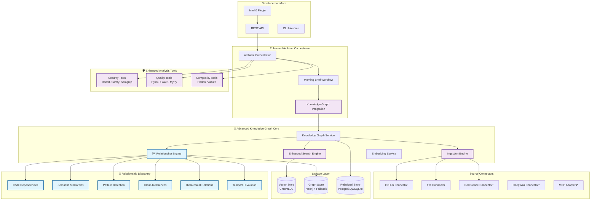

# DevEx Ambient Agent with Advanced Knowledge Graph

<div align="center">

**🚀 Elevating Developer Experience through Intelligent AI and Knowledge-Driven Code Evaluation**


[](https://langchain.com)

[](#)


An intelligent ambient agent that proactively analyzes code and provides morning briefings with actionable insights, enhanced with a sophisticated **Advanced Knowledge Graph system** featuring state-of-the-art relationship discovery and pattern detection algorithms.

[🚀 Quick Start](#-quick-start) •
[📖 Documentation](#-documentation) •
[🎯 Features](#-features) •
[🏗️ Architecture](#%EF%B8%8F-architecture) •
[🤝 Contributing](#-contributing)

</div>

---

## 📋 Table of Contents

- [✨ Features](#-features)
- [🏗️ Architecture](#%EF%B8%8F-architecture)
- [🔧 Technology Stack](#-technology-stack)
- [🚀 Quick Start](#-quick-start)
- [⚙️ Installation](#%EF%B8%8F-installation)
- [📚 Knowledge Graph Setup](#-knowledge-graph-setup)
- [🧪 Enhanced Analysis Setup](#-enhanced-analysis-setup)
- [🎯 Usage Examples](#-usage-examples)
- [📖 API Reference](#-api-reference)
- [🧪 Testing](#-testing)
- [🚀 Deployment](#-deployment)
- [🔧 Configuration](#-configuration)
- [🐛 Troubleshooting](#-troubleshooting)
- [🤝 Contributing](#-contributing)
- [🔮 Roadmap](#-roadmap)
- [📄 License](#-license)
- [🆘 Support](#-support)

---

## ✨ Features

### 🌟 Core Ambient Agent

- **🌅 Enhanced Morning Brief Generation**: Intelligent daily summaries using LangGraph workflows **with Knowledge Graph insights**
- **🔬 Professional Code Analysis**: Real-world security and quality analysis with industry-standard tools
- **📊 AI-Powered Pattern Detection**: Advanced LLM-based pattern recognition and anomaly detection
- **🔄 Event-Driven Architecture**: Seamless integration with IDEs and development tools
- **⚡ Real-time Processing**: Ambient event processing with intelligent prioritization

### 🧠 Advanced Knowledge Graph System

#### **🚀 NEW: Advanced Relationship Discovery Engine**
- **🕸️ Multi-Algorithm Relationship Detection**: 
  - **Code Dependencies**: AST-based import analysis, function call mapping
  - **Semantic Similarities**: Vector embedding-based content matching  
  - **Design Pattern Detection**: Singleton, Factory, Observer, Strategy, Decorator patterns
  - **Cross-References**: Documentation-to-code and issue-to-code linking
  - **Hierarchical Relationships**: Class inheritance and composition analysis
  - **Temporal Evolution**: Version superseding and evolution tracking

#### **📊 Graph Analysis Algorithms**
- **Centrality Metrics**: Identify the most important/connected entities
- **Community Detection**: Find clusters of related functionality
- **Influence Analysis**: Understanding which patterns influence others
- **Path Analysis**: Shortest paths and relationship strength calculations

#### **🎯 Intelligent Code Evaluation & Context**
- **📚 Golden Source Management**: Register GitHub repos, Confluence pages, DeepWiki content, and text files
- **🔍 Advanced Semantic Search**: Multi-collection vector search with relationship enrichment
- **🎯 Pattern-Aware Code Evaluation**: Compare new code against established patterns with confidence scoring
- **🔗 Intelligent Relationship Mapping**: Understand dependencies, similarities, and conflicts between code patterns
- **⚡ Context-Aware Recommendations**: Receive relevant knowledge precisely when and where you need it
- **🤖 Golden Source Alignment**: Track how well your code aligns with organizational standards

#### **🚀 Enhanced Morning Brief Integration**
- **📊 Golden Source Alignment Scores**: How well recent changes follow established patterns
- **🔍 Pattern-Based Insights**: Recommendations based on similar code patterns from golden sources
- **📚 Contextual Documentation**: Relevant docs and examples for current development context
- **🎯 Relationship-Aware Suggestions**: Guidance based on code relationships and dependencies

### 🛡️ Advanced Code Analysis

- **🔐 Security Analysis**: Bandit, Safety, Semgrep for comprehensive security scanning
- **📏 Quality Metrics**: Pylint, Flake8, MyPy for code quality and style analysis
- **📈 Complexity Analysis**: Radon for cyclomatic complexity measurement
- **🧹 Dead Code Detection**: Vulture for unused code identification
- **📄 Enhanced Reporting**: File-level details with line numbers, severity levels, and actionable insights

---

## 🏗️ Architecture



### 🔗 Relationship Types Discovered

The Advanced Relationship Engine discovers and analyzes **8 distinct relationship types**:

| Relationship Type | Description | Use Cases |
|------------------|-------------|-----------|
| **DEPENDS_ON** | Code imports, function calls, dependencies | Impact analysis, refactoring guidance |
| **SIMILAR_TO** | Semantically related content | Code reuse, pattern discovery |
| **IMPLEMENTS** | Design pattern implementations | Architecture consistency |
| **RELATED_TO** | Cross-references (docs ↔ code, issues ↔ code) | Knowledge linking, documentation gaps |
| **INHERITS_FROM** | Class inheritance, interface implementation | Hierarchy analysis, OOP insights |
| **SUPERSEDES** | Temporal evolution, version relationships | Change tracking, deprecation |
| **INSPIRED_BY** | Influence and derivation patterns | Learning paths, best practice adoption |
| **CONTRADICTS** | Conflicting implementations *(planned)* | Consistency checking, conflict resolution |

---

## 🔧 Technology Stack

### Core Technologies
- **Python 3.9+** - Primary development language
- **uv** - Modern, fast dependency management (migrated from Poetry)
- **FastAPI** - High-performance async web framework
- **LangChain & LangGraph** - Advanced AI workflow orchestration
- **Pydantic** - Data validation and serialization

### Knowledge Graph & AI
- **ChromaDB** - Vector database for semantic search and embeddings
- **Neo4j** - Graph database for relationship storage (with in-memory fallback)
- **SentenceTransformers** - Text embedding generation (`all-MiniLM-L6-v2`)
- **OpenAI API** - LLM integration for intelligent analysis
- **Advanced Graph Algorithms** - Custom relationship discovery and analysis

### Code Analysis Tools
- **Security**: Bandit, Safety, Semgrep
- **Quality**: Pylint, Flake8, MyPy
- **Complexity**: Radon (cyclomatic complexity)
- **Dead Code**: Vulture
- **AST Analysis** - Python Abstract Syntax Tree parsing for dependency detection

### Source Integration
- **GitHub API** - Repository content and metadata ingestion
- **File System** - Local file and directory scanning
- **HTTP/REST** - Generic connector framework
- **Future**: Confluence, DeepWiki, MCP protocol adapters

---

## 🚀 Quick Start

### Prerequisites
- Python 3.9+
- [uv](https://github.com/astral-sh/uv) for dependency management
- Git
- Optional: Neo4j for advanced graph features

### Installation
```bash
# Clone the repository
git clone https://github.com/your-org/devex-agent.git
cd devex-agent

# Install dependencies with uv
uv sync

# Set up environment
cp env.example .env
# Edit .env with your configuration (OpenAI API key, etc.)

# Start the agent
uv run python -m devex_agent.main
```

### First Knowledge Graph Setup
```bash
# Register your first golden source (local files)
curl -X POST "http://localhost:8000/api/v1/knowledge-graph/sources" \
  -H "Content-Type: application/json" \
  -d '{
    "type": "file",
    "config": {
      "name": "My Project Code",
      "description": "Local codebase for analysis",
      "path": "/path/to/your/project",
      "include_extensions": [".py", ".js", ".md"],
      "recursive": true
    },
    "priority": "high",
    "enabled": true
  }'

# Trigger content ingestion and relationship discovery
curl -X POST "http://localhost:8000/api/v1/knowledge-graph/sources/{source_id}/ingest?force=true"

# Get your enhanced morning brief
curl "http://localhost:8000/brief/morning/your_developer_id"
```

---

## ⚙️ Installation

### Full Installation (Recommended)
```bash
# Clone repository
git clone https://github.com/your-org/devex-agent.git
cd devex-agent

# Install with all dependencies
uv sync

# Install enhanced analysis tools
uv run bandit --version  # Verify security tools
uv run pylint --version  # Verify quality tools

# Optional: Install Neo4j for advanced graph features
# See: https://neo4j.com/docs/operations-manual/current/installation/
```

### Minimal Installation
```bash
# Core features only
uv sync --no-dev

# Basic analysis tools
pip install bandit safety
```

### Development Installation
```bash
# Full development environment
uv sync --group dev

# Install pre-commit hooks
uv run pre-commit install

# Run tests
uv run pytest tests/
```

---

## 📚 Knowledge Graph Setup

### Supported Source Types

#### 🐙 GitHub Repositories
```json
{
  "type": "github",
  "config": {
    "name": "FastAPI Core",
    "repository": "tiangolo/fastapi",
    "branch": "main",
    "include_patterns": ["*.py", "*.md"],
    "exclude_patterns": ["test_*", "*/tests/*"],
    "access_token": "github_pat_...",
    "include_issues": true,
    "include_prs": true
  }
}
```

#### 📁 Local File Systems
```json
{
  "type": "file", 
  "config": {
    "name": "Project Documentation",
    "path": "/path/to/docs",
    "include_extensions": [".md", ".rst", ".txt"],
    "exclude_directories": [".git", "node_modules"],
    "recursive": true
  }
}
```

#### 🌐 Confluence Spaces *(Coming Soon)*
```json
{
  "type": "confluence",
  "config": {
    "name": "Team Wiki",
    "base_url": "https://company.atlassian.net/wiki",
    "space_key": "DEV",
    "username": "user@company.com",
    "api_token": "..."
  }
}
```

### Environment Configuration

Create a `config/golden-sources.yaml`:

```yaml
# Golden Sources Configuration
sources:
  - id: "fastapi-reference"
    type: "github"
    config:
      name: "FastAPI Reference Implementation"
      repository: "tiangolo/fastapi"
      branch: "main"
      include_patterns: ["*.py"]
      include_issues: true
    priority: "high"
    auto_sync: true
    sync_interval: "6h"

  - id: "team-standards"
    type: "file"
    config:
      name: "Team Coding Standards"
      path: "./docs/standards"
      recursive: true
      include_extensions: [".md", ".py"]
    priority: "critical"
    auto_sync: false

# Global settings
settings:
  default_similarity_threshold: 0.7
  max_results_per_search: 10
  enable_relationship_discovery: true
  relationship_discovery_depth: 3
```

### Advanced Relationship Discovery Configuration

```python
# Relationship Engine Settings
RELATIONSHIP_ENGINE_CONFIG = {
    "similarity_threshold": 0.7,      # Semantic similarity cutoff
    "pattern_threshold": 0.6,         # Design pattern detection cutoff  
    "dependency_confidence": 0.5,     # Code dependency confidence
    "enable_caching": True,           # Performance optimization
    "algorithms": {
        "code_dependencies": True,     # AST-based analysis
        "semantic_similarity": True,   # Vector embeddings
        "design_patterns": True,       # Pattern recognition
        "cross_references": True,      # Doc-code linking
        "hierarchical": True,          # Inheritance analysis
        "temporal": True               # Evolution tracking
    }
}
```

---

## 🧪 Enhanced Analysis Setup

### Install Analysis Tools

The agent integrates with professional code analysis tools:

```bash
# Security Analysis
uv run pip install bandit safety semgrep

# Quality Analysis  
uv run pip install pylint flake8 mypy

# Complexity Analysis
uv run pip install radon vulture

# Verify installations
uv run bandit --version
uv run safety --version
uv run pylint --version
```

### Test Enhanced Analysis

```bash
# Run enhanced analysis on current project
uv run python -c "
from src.devex_agent.workflows.enhanced_code_analyzer import run_enhanced_analysis
import asyncio
result = asyncio.run(run_enhanced_analysis('.'))
print(f'Found {len(result[\"security_issues\"])} security issues')
print(f'Found {len(result[\"quality_issues\"])} quality issues')
"
```

---

## 🎯 Usage Examples

### Morning Brief with Knowledge Graph Insights

```bash
# Get enhanced morning brief
curl "http://localhost:8000/brief/morning/alice@company.com"
```

**Response includes**:
```json
{
  "developer_id": "alice@company.com",
  "summary": "Good morning! Your recent changes align 85% with golden source patterns...",
  "knowledge_graph_insights": {
    "golden_source_alignment": 0.85,
    "pattern_matches_count": 12,
    "top_pattern_matches": [
      {
        "pattern_name": "FastAPI Route Pattern",
        "source_id": "fastapi-reference", 
        "confidence": 0.92,
        "description": "Similar endpoint structure found in FastAPI docs"
      }
    ],
    "relevant_documentation_count": 3,
    "recommendations_count": 5,
    "coverage_gaps_count": 2
  },
  "suggestions": [
    {
      "type": "knowledge_graph",
      "title": "Consider FastAPI dependency injection pattern",
      "description": "Your authentication code could benefit from FastAPI's dependency injection",
      "priority": "medium",
      "source": "code_evaluation"
    }
  ]
}
```

### Advanced Code Evaluation

```bash
curl -X POST "http://localhost:8000/api/v1/knowledge-graph/evaluate" \
  -H "Content-Type: application/json" \
  -d '{
    "developer_id": "alice@company.com",
    "code_content": "async def get_user(db: Session, user_id: int):\n    return db.query(User).filter(User.id == user_id).first()",
    "file_path": "api/users.py",
    "language": "python"
  }'
```

**Response**:
```json
{
  "overall_alignment_score": 0.78,
  "pattern_matches": [
    {
      "pattern_name": "SQLAlchemy Query Pattern",
      "confidence": 0.85,
      "similarity_score": 0.92,
      "description": "Matches established database query patterns"
    }
  ],
  "recommendations": [
    {
      "type": "enhancement", 
      "title": "Add error handling",
      "description": "Consider adding try-catch for database errors",
      "priority": "medium"
    }
  ],
  "quality_score": 0.82,
  "security_score": 0.75,
  "maintainability_score": 0.88
}
```

### Semantic Search with Relationships

```bash
curl -X POST "http://localhost:8000/api/v1/knowledge-graph/search" \
  -H "Content-Type: application/json" \
  -d '{
    "query": "authentication middleware implementation",
    "developer_id": "alice@company.com", 
    "max_results": 5,
    "include_relationships": true,
    "similarity_threshold": 0.6
  }'
```

### Relationship Discovery

```bash
# Trigger relationship discovery for a source
curl -X POST "http://localhost:8000/api/v1/knowledge-graph/sources/{source_id}/discover-relationships"

# Get relationships for an entity  
curl "http://localhost:8000/api/v1/knowledge-graph/relationships/{entity_id}"
```

**Response**:
```json
{
  "entity_id": "auth_middleware_py_123",
  "relationships": [
    {
      "target_entity_id": "user_model_py_456", 
      "relationship_type": "DEPENDS_ON",
      "strength": 0.9,
      "description": "Imports User model for authentication",
      "metadata": {
        "dependency_type": "import",
        "language": "python",
        "source_line": 3
      }
    },
    {
      "target_entity_id": "jwt_utils_py_789",
      "relationship_type": "SIMILAR_TO", 
      "strength": 0.78,
      "description": "Similar JWT token handling patterns"
    }
  ]
}
```

### IntelliJ Plugin Integration

The enhanced morning brief and Knowledge Graph insights are automatically available in your IntelliJ IDE through the DevEx plugin:

1. **Morning Brief Panel**: View golden source alignment and recommendations
2. **Context-Aware Suggestions**: Get real-time suggestions based on current file
3. **Pattern Recognition**: Highlight code patterns that match golden sources
4. **Relationship Visualization**: See how your current code relates to other components

---

## 📖 API Reference

### Enhanced Knowledge Graph Endpoints

#### Core Operations
- `POST /api/v1/knowledge-graph/sources` - Register golden source
- `GET /api/v1/knowledge-graph/sources` - List all sources  
- `POST /api/v1/knowledge-graph/sources/{id}/ingest` - Trigger ingestion
- `DELETE /api/v1/knowledge-graph/sources/{id}` - Remove source

#### Advanced Search & Evaluation
- `POST /api/v1/knowledge-graph/search` - Semantic search with relationships
- `POST /api/v1/knowledge-graph/evaluate` - Code evaluation against golden sources
- `GET /api/v1/knowledge-graph/context/{developer_id}` - Get contextual knowledge

#### 🚀 NEW: Relationship Discovery
- `POST /api/v1/knowledge-graph/sources/{id}/discover-relationships` - Trigger relationship discovery
- `GET /api/v1/knowledge-graph/relationships/{entity_id}` - Get entity relationships
- `GET /api/v1/knowledge-graph/relationships/{entity_id}/paths` - Find relationship paths
- `GET /api/v1/knowledge-graph/analytics/centrality` - Get centrality metrics
- `GET /api/v1/knowledge-graph/analytics/communities` - Get community clusters

#### Enhanced Morning Brief
- `GET /brief/morning/{developer_id}` - Enhanced morning brief with KG insights

### Request/Response Models

#### Enhanced Search Request
```json
{
  "query": "authentication implementation",
  "developer_id": "alice@company.com",
  "current_file": "auth/middleware.py",
  "language": "python", 
  "max_results": 10,
  "include_relationships": true,
  "similarity_threshold": 0.7,
  "relationship_types": ["DEPENDS_ON", "SIMILAR_TO", "IMPLEMENTS"]
}
```

#### Relationship Discovery Response
```json
{
  "source_id": "my-project",
  "relationships_discovered": 247,
  "relationship_breakdown": {
    "DEPENDS_ON": 89,
    "SIMILAR_TO": 56, 
    "IMPLEMENTS": 23,
    "RELATED_TO": 34,
    "INHERITS_FROM": 18,
    "SUPERSEDES": 12,
    "INSPIRED_BY": 15
  },
  "analysis_metrics": {
    "centrality_scores": {...},
    "communities": [...],
    "total_nodes": 156,
    "total_edges": 247
  }
}
```

---

## 🧪 Testing

### Run All Tests
```bash
# Core functionality tests
uv run pytest tests/unit/

# Integration tests
uv run pytest tests/integration/

# Knowledge Graph tests
uv run pytest tests/knowledge_graph/

# Manual testing
uv run python tests/manual_test_runner.py
```

### Test Enhanced Features

```bash
# Test relationship discovery
uv run python -c "
import asyncio
from src.devex_agent.knowledge_graph.engines.relationship_engine import RelationshipEngine

async def test():
    engine = RelationshipEngine()
    await engine.initialize()
    print('✅ Relationship Engine initialized')
    
asyncio.run(test())
"

# Test semantic search
curl -X POST "http://localhost:8000/api/v1/knowledge-graph/search" \
  -H "Content-Type: application/json" \
  -d '{"query": "test pattern", "developer_id": "test"}'
```

### Performance Testing

```bash
# Test relationship discovery performance
uv run python scripts/benchmark_relationship_discovery.py

# Test search performance
uv run python scripts/benchmark_search.py

# Memory usage analysis
uv run python scripts/memory_analysis.py
```

---

## 🚀 Deployment

### Docker Deployment *(Coming Soon)*

```dockerfile
FROM python:3.11-slim

# Install uv
RUN pip install uv

# Copy project
COPY . /app
WORKDIR /app

# Install dependencies
RUN uv sync --no-dev

# Install analysis tools
RUN uv run pip install bandit safety pylint flake8

# Expose port
EXPOSE 8000

# Start agent
CMD ["uv", "run", "python", "-m", "devex_agent.main"]
```

### Production Configuration

```yaml
# docker-compose.yml
version: '3.8'

services:
  devex-agent:
    build: .
    ports:
      - "8000:8000"
    environment:
      - OPENAI_API_KEY=${OPENAI_API_KEY}
      - NEO4J_URI=bolt://neo4j:7687
    depends_on:
      - neo4j
      - chroma

  neo4j:
    image: neo4j:5.0
    environment:
      - NEO4J_AUTH=neo4j/password
    volumes:
      - neo4j_data:/data

  chroma:
    image: chromadb/chroma:latest
    volumes:
      - chroma_data:/chroma/chroma

volumes:
  neo4j_data:
  chroma_data:
```

---

## 🔧 Configuration

### Environment Variables

```bash
# Core Configuration  
DEVEX_HOST=localhost
DEVEX_PORT=8000
DEVEX_DEBUG=true

# LLM Configuration
OPENAI_API_KEY=sk-...
LLM_MODEL=gpt-3.5-turbo
LLM_TEMPERATURE=0.1

# Knowledge Graph
VECTOR_DB_PATH=./data/vector_store
NEO4J_URI=bolt://localhost:7687
NEO4J_USERNAME=neo4j
NEO4J_PASSWORD=password
DATABASE_URL=sqlite:///./devex_agent.db

# Enhanced Analysis
ENABLE_ENHANCED_ANALYSIS=true
BANDIT_CONFIG_PATH=./config/bandit.yaml
PYLINT_CONFIG_PATH=./config/pylintrc

# Relationship Discovery
ENABLE_RELATIONSHIP_DISCOVERY=true
SIMILARITY_THRESHOLD=0.7
PATTERN_THRESHOLD=0.6
RELATIONSHIP_CACHE_SIZE=1000
```

### Advanced Configuration

```python
# config/advanced_settings.py
KNOWLEDGE_GRAPH_CONFIG = {
    "vector_store": {
        "provider": "chromadb",
        "embedding_model": "all-MiniLM-L6-v2",
        "similarity_threshold": 0.7,
        "max_results": 50
    },
    "graph_store": {
        "provider": "neo4j",
        "fallback_to_memory": True,
        "relationship_types": [
            "DEPENDS_ON", "SIMILAR_TO", "IMPLEMENTS",
            "RELATED_TO", "INHERITS_FROM", "SUPERSEDES"
        ]
    },
    "relationship_engine": {
        "algorithms": {
            "code_dependencies": {
                "enabled": True,
                "languages": ["python", "javascript", "java", "typescript"],
                "confidence_threshold": 0.8
            },
            "semantic_similarity": {
                "enabled": True,
                "threshold": 0.7,
                "use_caching": True
            },
            "design_patterns": {
                "enabled": True,
                "patterns": ["singleton", "factory", "observer", "strategy", "decorator"],
                "threshold": 0.6
            },
            "cross_references": {
                "enabled": True,
                "doc_to_code": True,
                "issue_to_code": True
            }
        },
        "performance": {
            "batch_size": 100,
            "max_parallel": 4,
            "cache_size": 1000
        }
    }
}
```

---

## 🐛 Troubleshooting

### Common Issues

#### Knowledge Graph Not Working
```bash
# Check if services are running
uv run python -c "
from src.devex_agent.knowledge_graph.core.service import KnowledgeGraphService
import asyncio

async def check():
    kg = KnowledgeGraphService()
    await kg.initialize()
    print(f'KG initialized: {kg.is_initialized}')
    
asyncio.run(check())
"
```

#### Relationship Discovery Slow
```bash
# Check relationship engine configuration
uv run python -c "
from src.devex_agent.knowledge_graph.engines.relationship_engine import RelationshipEngine

engine = RelationshipEngine()
print(f'Similarity threshold: {engine.similarity_threshold}')
print(f'Pattern threshold: {engine.pattern_threshold}')
print('Try increasing thresholds for better performance')
"
```

#### Analysis Tools Not Found
```bash
# Verify tool installations
uv run bandit --version || echo "Install: uv run pip install bandit"
uv run pylint --version || echo "Install: uv run pip install pylint" 
uv run safety --version || echo "Install: uv run pip install safety"
```

#### Vector Search Issues
```bash
# Check ChromaDB
uv run python -c "
import chromadb
client = chromadb.Client()
print('ChromaDB collections:', client.list_collections())
"
```

#### Neo4j Connection Issues
```bash
# Test Neo4j connection
uv run python -c "
try:
    from neo4j import GraphDatabase
    driver = GraphDatabase.driver('bolt://localhost:7687', auth=('neo4j', 'password'))
    with driver.session() as session:
        result = session.run('RETURN 1')
        print('Neo4j connected successfully')
    driver.close()
except Exception as e:
    print(f'Neo4j connection failed: {e}')
    print('Agent will use in-memory fallback')
"
```

### Performance Optimization

#### Optimize Relationship Discovery
```python
# Increase thresholds for faster processing
RELATIONSHIP_ENGINE_CONFIG = {
    "similarity_threshold": 0.8,      # Higher = fewer relationships, faster
    "pattern_threshold": 0.7,         # Higher = fewer patterns, faster
    "enable_caching": True,           # Always enable for production
    "batch_size": 50,                 # Smaller batches for memory efficiency
}
```

#### Optimize Vector Search
```python
# Reduce search scope
SEARCH_CONFIG = {
    "max_results": 10,                # Limit results
    "similarity_threshold": 0.8,      # Higher threshold = fewer results
    "collections": ["documentation"], # Search specific collections only
}
```

---

## 🤝 Contributing

We welcome contributions to enhance the DevEx Agent's capabilities!

### Development Setup
```bash
# Clone and setup development environment
git clone https://github.com/your-org/devex-agent.git
cd devex-agent
uv sync --group dev

# Install pre-commit hooks
uv run pre-commit install

# Run tests
uv run pytest

# Run with development settings
DEVEX_DEBUG=true uv run python -m devex_agent.main
```

### Areas for Contribution

#### 🚀 High Priority
- **New Source Connectors**: Confluence, DeepWiki, custom APIs
- **Enhanced Pattern Detection**: Machine learning-based pattern discovery
- **Performance Optimization**: Parallel processing, advanced caching
- **UI Improvements**: Better visualization of relationships and insights

#### 🧠 Advanced Features
- **Custom Relationship Types**: Domain-specific relationship detection
- **Graph Visualization**: Interactive relationship mapping
- **ML Pattern Learning**: AI-powered pattern discovery from usage
- **Advanced Analytics**: Trend analysis, developer productivity metrics

### Submission Guidelines

1. **Fork** the repository
2. **Create** a feature branch (`git checkout -b feature/amazing-feature`)
3. **Test** your changes thoroughly
4. **Document** new features in the README
5. **Submit** a pull request with detailed description

### Testing Requirements

- All new features must include unit tests
- Integration tests for Knowledge Graph features
- Performance benchmarks for relationship discovery
- Documentation updates for new APIs

---

## 🔮 Roadmap

### 🚀 Current Version (2.0)
- ✅ Advanced Relationship Discovery Engine
- ✅ Enhanced Knowledge Graph Integration  
- ✅ Professional Code Analysis Tools
- ✅ Pattern-Aware Morning Briefs
- ✅ Multi-Algorithm Relationship Detection

### 🎯 Next Release (2.1)
- 🔄 **Confluence MCP Connector** - Team documentation integration
- 🔄 **Performance Optimization** - Parallel processing and advanced caching
- 🔄 **Graph Visualization** - Interactive relationship mapping UI
- 🔄 **Docker Production Setup** - Complete containerized deployment

### 🌟 Future Releases (2.2+)
- 🔮 **ML Pattern Discovery** - AI-powered custom pattern learning
- 🔮 **Advanced Analytics Dashboard** - Developer productivity insights
- 🔮 **Multi-Language AST Analysis** - Extended language support
- 🔮 **Real-time Collaboration** - Team-wide knowledge sharing
- 🔮 **Custom Relationship Types** - Domain-specific relationship detection
- 🔮 **Advanced Graph Algorithms** - PageRank, betweenness centrality, community detection

---

## 📄 License

This project is licensed under the MIT License - see the [LICENSE](LICENSE) file for details.

---

## 🆘 Support

### 🤔 FAQ

**Q: What makes this Knowledge Graph "advanced"?**
A: Our system uses state-of-the-art relationship discovery algorithms including AST-based code analysis, vector embeddings for semantic similarity, design pattern detection, and graph algorithms for community detection and centrality analysis.

**Q: How does the Relationship Discovery Engine work?**  
A: The engine analyzes code using multiple algorithms simultaneously: 
- **AST parsing** for precise dependency extraction
- **Vector embeddings** for semantic similarity 
- **Pattern matching** for design pattern recognition
- **Cross-reference analysis** for documentation-code linking
- **Graph algorithms** for influence and community detection

**Q: Can I use this without OpenAI?**
A: Yes! The Knowledge Graph, relationship discovery, and enhanced code analysis work independently. You'll miss LLM-powered insights but get all the advanced relationship mapping and search capabilities.

**Q: How accurate is the pattern detection?**
A: Pattern detection uses configurable confidence thresholds (default 60-70%). The system combines multiple signals including keyword matching, code structure analysis, and semantic similarity for robust pattern recognition.

**Q: What's the performance impact of relationship discovery?**
A: The engine is optimized with caching, batch processing, and configurable thresholds. Initial discovery takes time but subsequent queries are fast. You can adjust thresholds for performance vs accuracy trade-offs.

**Q: Does this work with private repositories?**
A: Absolutely! The agent supports GitHub access tokens for private repos and can analyze local file systems. All processing happens locally or in your controlled environment.

### 📧 Contact & Support

- **Issues**: [GitHub Issues](https://github.com/your-org/devex-agent/issues)
- **Discussions**: [GitHub Discussions](https://github.com/your-org/devex-agent/discussions)
- **Documentation**: [GitHub Wiki](https://github.com/your-org/devex-agent/wiki)
- **Security**: security@your-org.com

### 🔗 Related Projects

- **IntelliJ Plugin**: [DevEx IntelliJ Integration](https://github.com/your-org/devex-intellij-plugin)
- **VSCode Extension**: [DevEx VSCode Extension](https://github.com/your-org/devex-vscode) *(planned)*
- **CLI Tool**: [DevEx CLI](https://github.com/your-org/devex-cli) *(planned)*

---

<div align="center">

**🚀 Ready to revolutionize your development experience?**

[Get Started](#-quick-start) • [View Examples](#-usage-examples) • [Join Community](https://github.com/your-org/devex-agent/discussions)

**Built with ❤️ by the DevEx Team**

</div> 