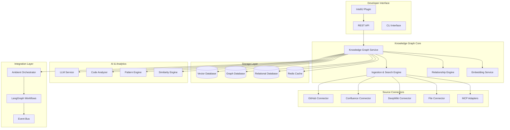

# DevEx Agent Knowledge Graph Architecture

## Executive Summary

The Knowledge Graph system extends the DevEx Ambient Agent to create a sophisticated reference system that enables developers to input "golden" sources (GitHub repositories, Confluence pages, DeepWiki content, text files) that the LLM uses to evaluate, inspire, and guide new code development. This system implements advanced retrieval-augmented generation (RAG) patterns with semantic search, relationship mapping, and contextual code analysis.

## Vision Alignment

This architecture directly supports the vision outlined in `vision/Agentic DevEx Assistant_ Elevating the Developer Experience.txt` by:

- **Learning from Organizational Knowledge**: Ingesting golden sources to understand best practices, patterns, and architectural decisions
- **Proactive Code Evaluation**: Using golden sources as benchmarks to evaluate new code quality, security, and adherence to standards
- **Contextual Assistance**: Providing relevant examples and guidance from golden sources during development
- **Knowledge Synthesis**: Connecting new code with established patterns and practices from trusted sources

## Architecture Overview



## Core Components

### 1. Knowledge Graph Service (KGS)

**Purpose**: Central orchestrator for all knowledge graph operations

**Responsibilities**:
- Manage golden source registration and metadata
- Coordinate ingestion workflows
- Provide unified search and retrieval APIs
- Handle knowledge graph queries and relationships
- Integrate with existing ambient workflows

**Key Features**:
- Source lifecycle management (add, update, remove, refresh)
- Multi-modal content processing (code, docs, images, diagrams)
- Semantic search with context awareness
- Real-time updates and synchronization
- Quality scoring and relevance ranking

### 2. Ingestion & Search Engine (ISE)

**Purpose**: Handles the ingestion of content from various sources and provides intelligent search capabilities

**Ingestion Pipeline**:
1. **Content Extraction**: Pull content from various sources
2. **Preprocessing**: Clean, normalize, and structure content
3. **Chunking**: Break content into semantic chunks
4. **Embedding Generation**: Create vector embeddings for semantic search
5. **Metadata Extraction**: Extract relevant metadata and relationships
6. **Storage**: Store in appropriate databases with proper indexing

**Search Capabilities**:
- Semantic similarity search using vector embeddings
- Hybrid search combining semantic and keyword search
- Contextual search based on current development context
- Multi-source federated search
- Real-time incremental search

### 3. Relationship Engine (REL)

**Purpose**: Maps and maintains relationships between different knowledge entities

**Relationship Types**:
- **Inherits From**: Code patterns, architectural decisions
- **Depends On**: Dependencies, prerequisites
- **Similar To**: Code similarity, pattern matching
- **Related To**: Thematic connections, project relationships
- **Contradicts**: Conflicting approaches or patterns
- **Supersedes**: Evolution of patterns or practices

**Capabilities**:
- Automatic relationship discovery using LLM analysis
- Manual relationship curation
- Relationship strength scoring
- Temporal relationship tracking
- Multi-dimensional relationship mapping

### 4. Source Connectors

#### GitHub Connector
- Repository structure analysis
- Code file ingestion and analysis
- README and documentation processing
- Issue and PR context extraction
- Commit history and change analysis
- Branch and tag management

#### Confluence Connector (MCP-based)
- Page content extraction and processing
- Space and hierarchy mapping
- Comment and collaboration history
- Attachment and media processing
- Template and macro handling
- Version history tracking

#### DeepWiki Connector
- Wiki page content extraction
- Category and tag processing
- Cross-reference and link analysis
- Media and file attachment handling
- Search and navigation structure mapping

#### File System Connector
- Local file ingestion (txt, md, pdf, docx)
- Directory structure analysis
- File metadata extraction
- Content type detection and processing
- Batch import capabilities

#### MCP Adapter Framework
- Extensible connector framework using Model Context Protocol
- Support for custom connectors
- Standard API interface for new source types
- Plugin architecture for community contributions

## Storage Architecture

### Vector Database (ChromaDB/Qdrant)
```
Collections:
- code_chunks: Code snippets with embeddings
- documentation: Documentation pages and sections
- patterns: Identified code patterns and practices
- conversations: Historical development discussions
- context: Contextual information and metadata
```

### Graph Database (Neo4j)
```
Nodes:
- Source: Golden source repositories/documents
- File: Individual files and documents
- Chunk: Content chunks and snippets
- Pattern: Identified patterns and practices
- Developer: Developer profiles and preferences
- Project: Active development projects

Relationships:
- CONTAINS: Source contains files
- CHUNKS_TO: Files chunk to content pieces
- SIMILAR_TO: Similarity relationships
- DEPENDS_ON: Dependency relationships
- IMPLEMENTS: Pattern implementation relationships
- INSPIRED_BY: Inspiration and reference relationships
```

### Relational Database (PostgreSQL)
```
Tables:
- kg_sources: Source registration and metadata
- kg_ingestion_jobs: Ingestion job tracking
- kg_search_history: Search and usage analytics
- kg_evaluations: Code evaluation results
- kg_feedback: Developer feedback and ratings
- kg_configurations: System and user configurations
```

## Integration with Existing System

### Ambient Orchestrator Integration

The Knowledge Graph integrates seamlessly with the existing Ambient Orchestrator:

```python
class AmbientOrchestrator:
    def __init__(self):
        # ... existing initialization
        self.knowledge_graph = KnowledgeGraphService()
    
    async def process_event(self, event_data: Dict[str, Any]) -> Dict[str, Any]:
        # ... existing event processing
        
        # Add knowledge graph context
        if event_data.get("type") == "file_changed":
            kg_context = await self.knowledge_graph.get_relevant_context(
                file_path=event_data.get("file_path"),
                developer_id=event_data.get("developer_id"),
                change_type=event_data.get("metadata", {}).get("change_type")
            )
            event_data["kg_context"] = kg_context
        
        return await self._process_with_kg_context(event_data)
```

### LangGraph Workflow Enhancement

Enhanced workflows with Knowledge Graph integration:

```python
class MorningBriefWorkflow:
    def __init__(self, openai_api_key: Optional[str] = None):
        # ... existing initialization
        self.knowledge_graph = KnowledgeGraphService()
    
    async def code_analysis_node(self, state: MorningBriefState) -> MorningBriefState:
        # ... existing analysis
        
        # Add golden source comparison
        kg_analysis = await self.knowledge_graph.evaluate_against_golden_sources(
            developer_id=state["developer_id"],
            recent_changes=state["event_categories"]["file_changes"],
            analysis_context=state.get("code_analysis", {})
        )
        
        # Enhance analysis with golden source insights
        state["code_analysis"]["golden_source_evaluation"] = kg_analysis
        return state
```

## New Components Implementation

### Knowledge Graph Service

```python
# src/devex_agent/knowledge_graph/core/service.py
class KnowledgeGraphService:
    def __init__(self):
        self.vector_store = VectorStoreManager()
        self.graph_db = GraphDatabaseManager()
        self.relational_db = RelationalDatabaseManager()
        self.ingestion_engine = IngestionEngine()
        self.search_engine = SearchEngine()
        self.relationship_engine = RelationshipEngine()
    
    async def register_golden_source(self, source_config: GoldenSourceConfig) -> str:
        """Register a new golden source for ingestion"""
        
    async def ingest_source(self, source_id: str) -> IngestionResult:
        """Ingest content from a registered source"""
        
    async def search_knowledge(self, query: KnowledgeQuery) -> SearchResults:
        """Search across all knowledge sources"""
        
    async def get_relevant_context(self, **context_params) -> KnowledgeContext:
        """Get relevant knowledge for current development context"""
        
    async def evaluate_code_against_golden_sources(self, code_analysis: Dict) -> EvaluationResult:
        """Evaluate code changes against golden source patterns"""
```

### Source Connector Framework

```python
# src/devex_agent/knowledge_graph/connectors/base.py
class BaseSourceConnector(ABC):
    @abstractmethod
    async def connect(self, config: SourceConfig) -> ConnectionResult:
        """Establish connection to the source"""
        
    @abstractmethod
    async def extract_content(self, source_id: str) -> ContentResult:
        """Extract content from the source"""
        
    @abstractmethod
    async def get_metadata(self, source_id: str) -> MetadataResult:
        """Get metadata about the source"""
        
    @abstractmethod
    async def detect_changes(self, source_id: str, last_sync: datetime) -> ChangeResult:
        """Detect changes since last sync"""
```

## API Extensions

### New REST Endpoints

```python
# Knowledge Graph Management
POST   /api/v1/knowledge-graph/sources           # Register golden source
GET    /api/v1/knowledge-graph/sources           # List sources
PUT    /api/v1/knowledge-graph/sources/{id}      # Update source
DELETE /api/v1/knowledge-graph/sources/{id}      # Remove source
POST   /api/v1/knowledge-graph/sources/{id}/ingest  # Trigger ingestion

# Search and Retrieval
POST   /api/v1/knowledge-graph/search            # Search knowledge base
GET    /api/v1/knowledge-graph/context/{dev_id}  # Get contextual knowledge
POST   /api/v1/knowledge-graph/evaluate          # Evaluate code against sources

# Relationships and Analytics
GET    /api/v1/knowledge-graph/relationships     # Get relationships
POST   /api/v1/knowledge-graph/feedback          # Submit feedback
GET    /api/v1/knowledge-graph/analytics         # Usage analytics
```

## Developer Experience

### IDE Plugin Integration

```kotlin
// IntelliJ Plugin Enhancement
class KnowledgeGraphService {
    suspend fun getCodeSuggestions(
        currentFile: String,
        selectedCode: String,
        context: DevelopmentContext
    ): List<GoldenSourceSuggestion>
    
    suspend fun evaluateAgainstGoldenSources(
        changedFiles: List<String>
    ): CodeEvaluationResult
    
    suspend fun findSimilarPatterns(
        codeSnippet: String,
        language: String
    ): List<SimilarPattern>
}
```

### Enhanced Morning Brief

The morning brief will include:
- **Golden Source Alignment**: How recent work aligns with established patterns
- **Best Practice Suggestions**: Recommendations based on golden sources
- **Pattern Recognition**: Identification of emerging patterns vs. established ones
- **Knowledge Gaps**: Areas where golden sources could provide guidance

## Implementation Roadmap

### Phase 1: Foundation (Weeks 1-2)
- [ ] Core Knowledge Graph Service framework
- [ ] Basic storage layer setup (Vector, Graph, Relational DBs)
- [ ] Simple file-based connector
- [ ] Basic search functionality

### Phase 2: Core Features (Weeks 3-4)
- [ ] GitHub connector implementation
- [ ] Confluence MCP connector integration
- [ ] Relationship engine basic functionality
- [ ] Integration with morning brief workflow

### Phase 3: Advanced Features (Weeks 5-6)
- [ ] Pattern recognition and evaluation
- [ ] Advanced relationship mapping
- [ ] IntelliJ plugin integration
- [ ] Real-time context awareness

### Phase 4: Polish & Scale (Weeks 7-8)
- [ ] Performance optimization
- [ ] Advanced analytics and insights
- [ ] Additional source connectors
- [ ] Comprehensive testing and documentation

## Configuration and Management

### Golden Source Configuration

```yaml
# config/golden-sources.yaml
golden_sources:
  - id: "company-backend-patterns"
    type: "github"
    config:
      repository: "company/backend-standards"
      branch: "main"
      include_patterns: ["src/**/*.py", "docs/**/*.md"]
      exclude_patterns: ["tests/**/*"]
    priority: "high"
    auto_sync: true
    sync_interval: "1h"
    
  - id: "architecture-decisions"
    type: "confluence"
    config:
      space_key: "ARCH"
      page_filter: "label = 'architecture-decision'"
    priority: "high"
    auto_sync: true
    sync_interval: "6h"
    
  - id: "coding-standards"
    type: "file"
    config:
      path: "/docs/standards"
      include_extensions: [".md", ".txt"]
    priority: "medium"
    auto_sync: false
```

## Quality Assurance and Testing

### Testing Strategy
- Unit tests for all core components
- Integration tests for source connectors
- End-to-end workflow testing
- Performance and scalability testing
- Security and privacy testing

### Quality Metrics
- Ingestion success rate and speed
- Search relevance and accuracy
- Context recommendation quality
- Developer satisfaction scores
- System performance metrics

## Security and Privacy

### Data Protection
- Sensitive content filtering and masking
- Access control and permissions management
- Audit logging for all operations
- Encryption at rest and in transit
- GDPR and compliance considerations

### Privacy Controls
- Developer opt-in/opt-out mechanisms
- Content anonymization options
- Data retention policies
- Right to deletion
- Usage analytics privacy

## Success Metrics

### Developer Productivity
- Reduced time to find relevant examples
- Increased code quality scores
- Faster onboarding for new developers
- Improved pattern consistency across teams

### System Effectiveness
- Knowledge discovery accuracy
- Contextual relevance scores
- Source freshness and coverage
- Developer engagement metrics

## Future Enhancements

### Advanced AI Features
- Automatic pattern extraction and codification
- Code generation based on golden source patterns
- Predictive suggestions for development directions
- Automated refactoring recommendations

### Extended Integrations
- Support for more source types (Slack, Teams, Notion)
- Integration with external code quality tools
- Real-time collaboration features
- Advanced analytics and reporting

This architecture provides a robust foundation for implementing a sophisticated knowledge graph system that seamlessly integrates with the existing DevEx Ambient Agent while providing powerful new capabilities for code evaluation and developer guidance. 